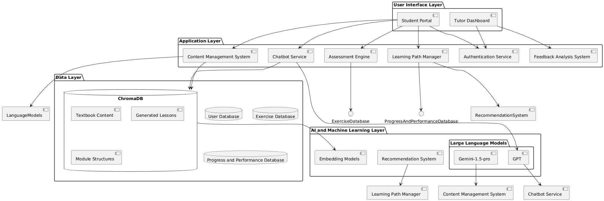

# AICOG-Tutor: A Hybrid Intelligence Framework for Personalised Machine Learning Education

## Project Overview
This project is an innovative hybrid intelligence-based personalized learning system designed to teach machine learning to undergraduate students. It combines AI-generated content with human expertise to create an adaptive, engaging learning experience. The system is designed to provide a tailored and adaptive learning experience for undergraduate computer science students, focusing on machine learning education. By leveraging AI technologies such as large language models, retrieval-augmented generation, and cognitive psychology insights, the system aims to dynamically adjust content, pacing, and instructional strategies based on individual student needs.

## Key Features
- **Dual-user System**: Supports both student and tutor interactions
- **AI-generated Lessons**: Utilizes Gemini-1.5-pro for dynamic content creation
- **Interactive Learning**: Includes quizzes and a chatbot  for student engagement
- **Adaptive Learning Path**: Adjusts based on student performance and tutor feedback
- **Comprehensive Assessment**: Includes module exercises and quizzes
- **Tutor Dashboard**: For monitoring student progress and providing feedback

## Architecture
The system is built on a layered architecture:
1. User Interface Layer
2. Application Layer
3. Data Layer
4. AI and Machine Learning Layer
5. Infrastructure Layer



## Technologies Used
- **Frontend**: Streamlit
- **Backend**: Python
- **Framework**: Langchain
- **Databases**: ChromaDB, MongoDb
- **AI Models**: Gemini-1.5-pro, GPT, OpenAI gpt-4o
- **Cloud Services**: [GCP]

## Getting Started
[Include instructions on how to set up and run your project locally]

```bash
# Example commands to set up the project
git clone [https://github.com/Aditya-Kaul/personalised-learning-system.git]
cd personalised-learning-system
pip install -r requirements.txt
streamlit run app.py
