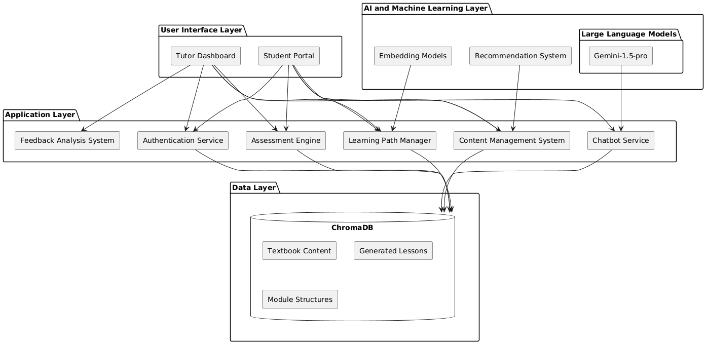
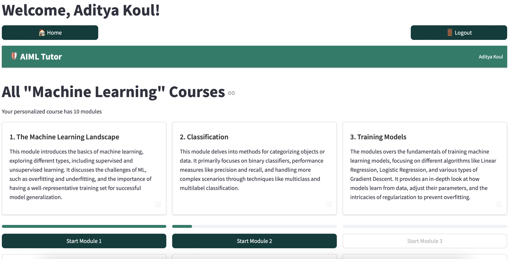
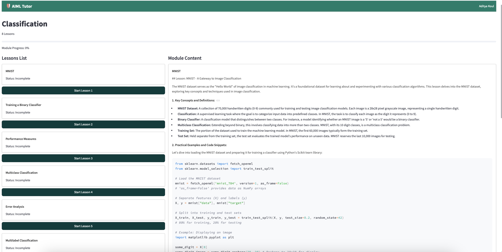
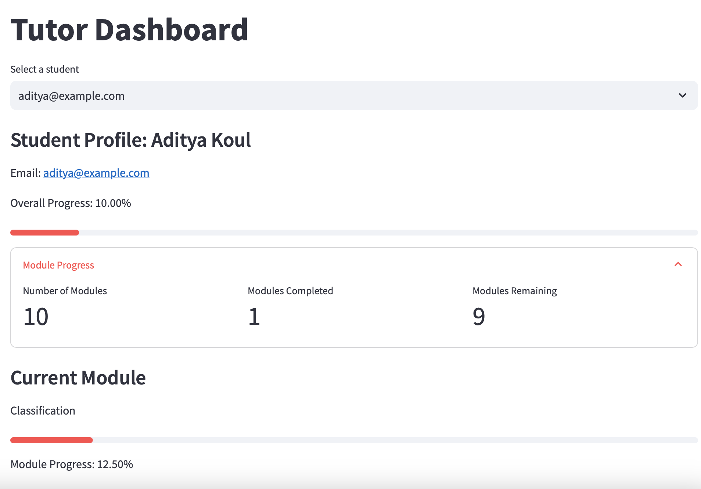
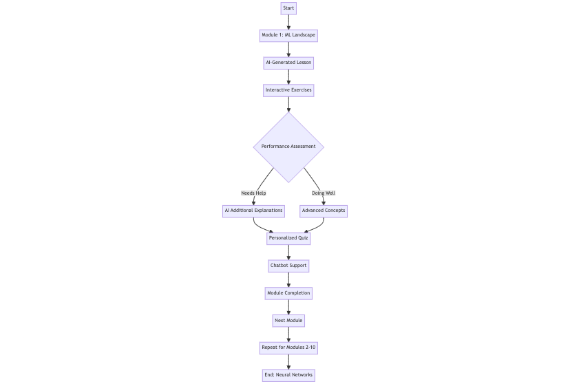

# ML Mentor: A Human-in-the-Loop Approach to Personalized Machine Learning Education

## Table of Contents
- [ML Mentor: A Human-in-the-Loop Approach to Personalized Machine Learning Education](#ml-mentor-a-human-in-the-loop-approach-to-personalized-machine-learning-education)
  - [Table of Contents](#table-of-contents)
  - [Introduction](#introduction)
  - [Features](#features)
  - [System Architecture](#system-architecture)
  - [Technologies Used](#technologies-used)
  - [Setup and Installation](#setup-and-installation)
  - [Usage Guide](#usage-guide)
    - [Student Portal](#student-portal)
    - [Tutor Dashboard](#tutor-dashboard)
  - [AI and Machine Learning Components](#ai-and-machine-learning-components)
  - [Data Management](#data-management)
  - [Security and Authentication](#security-and-authentication)
  - [Customization and Extension](#customization-and-extension)
  - [Troubleshooting](#troubleshooting)
  - [Visual Guide](#visual-guide)
    - [System Architecture Diagram](#system-architecture-diagram)
    - [User Interface Screenshots](#user-interface-screenshots)
      - [Student Dashboard](#student-dashboard)
      - [Lesson Page](#lesson-page)
      - [Tutor Dashboard](#tutor-dashboard-1)
    - [Learning Flow Diagram](#learning-flow-diagram)
  - [Contributing](#contributing)
  - [License](#license)
  - [Acknowledgements](#acknowledgements)

## Introduction

ML Mentor is an innovative, AI-powered personalized learning system designed to revolutionize the way students learn machine learning concepts. Built around the textbook "Hands-On Machine Learning with Scikit-Learn, Keras, and TensorFlow" by Aurélien Géron, this system provides an adaptive, interactive learning experience tailored to each student's needs.

The project aims to address common challenges in e-learning, such as lack of personalization, immediate feedback, and adaptive content. By leveraging advanced AI technologies, including large language models and recommendation systems, ML Mentor creates a dynamic learning environment that evolves with the student's progress.

## Features

- **Personalized Learning Paths**: Adapts course content based on student performance and learning style.
- **AI-Generated Lessons**: Utilizes the Gemini-1.5-pro model to dynamically generate lesson content.
- **Interactive Quizzes**: Automatically generated quizzes to test understanding after each lesson.
- **Real-time Q&A**: An AI-powered chatbot for immediate answers to student questions.
- **Progress Tracking**: Detailed progress monitoring for both students and tutors.
- **Tutor Dashboard**: Allows tutors to monitor student progress, grade exercises, and provide feedback.
- **Adaptive Assessments**: Tailors difficulty based on student performance.
- **Multi-module Structure**: Covers various aspects of machine learning in a structured format.
- **Exercise Submission and Feedback**: Students can submit exercises for tutor review and receive personalized feedback.

## System Architecture

The ML Mentor system is built on a layered architecture, ensuring modularity, scalability, and ease of maintenance. The main components are:

1. **User Interface Layer**
   - Student Portal
   - Tutor Dashboard

2. **Application Layer**
   - Authentication Service
   - Content Management System
   - Learning Path Manager
   - Assessment Engine
   - Chatbot Service
   - Feedback Analysis System

3. **Data Layer**
   - ChromaDB (Vector Database)
     - Textbook Content
     - Generated Lessons
     - Module Structures
     - User Data

4. **AI and Machine Learning Layer**
   - Large Language Models (Gemini-1.5-pro)
   - Embedding Models
   - Recommendation System

## Technologies Used

- **Frontend**: Streamlit
- **Backend**: Python
- **Database**: ChromaDB (Vector Database)
- **AI/ML**: 
  - Google's Generative AI (Gemini-1.5-pro)
  - LangChain for AI orchestration
- **Authentication**: Custom implementation with hashing
- **Version Control**: Git

## Setup and Installation

1. **Clone the Repository**
   ```
   git clone https://github.com/Aditya-Kaul/personalised-learning-system.git
   cd personalised-learning-system
   ```

2. **Set Up a Virtual Environment**
   ```
   python -m venv venv
   source venv/bin/activate  # On Windows, use `venv\Scripts\activate`
   ```

3. **Install Dependencies**
   ```
   pip install -r requirements.txt
   ```

4. **Set Up Environment Variables**
   Create a `.env` file in the root directory and add:
   ```
   GOOGLE_API_KEY=your_google_api_key_here
   ```

5. **Initialize the Database**
   ```
   python3 new_config.py
   ```

6. **Run the Application**
   ```
   streamlit run app.py
   ```

## Usage Guide

### Student Portal

1. **Registration/Login**: 
   - New students can register with their email and password.
   - Existing students can log in using their credentials.

2. **Course Navigation**:
   - After logging in, students see a dashboard with available modules.
   - Each module shows progress and allows students to start or continue lessons.

3. **Lesson Interaction**:
   - Students can read AI-generated lesson content.
   - Interactive elements like code snippets and diagrams are available.
   - Students can ask questions using the Q&A chatbot.

4. **Quizzes and Exercises**:
   - After each lesson, students can take automatically generated quizzes.
   - Module exercises can be submitted for tutor review.

5. **Progress Tracking**:
   - Students can view their overall progress and individual module completion status.

### Tutor Dashboard

1. **Login**: Tutors log in using their credentials.

2. **Student Management**:
   - View a list of enrolled students.
   - Select individual students to view their progress.

3. **Progress Monitoring**:
   - See detailed progress reports for each student.
   - View module completion rates and quiz scores.

4. **Exercise Review**:
   - Access submitted exercises.
   - Provide feedback and grades for student work.

5. **Feedback System**:
   - Send personalized feedback to students.
   - Recommend additional resources or review material as needed.

## AI and Machine Learning Components

1. **Lesson Generation**:
   - Uses Gemini-1.5-pro to create personalized lesson content.
   - Incorporates context from the textbook and module structure.

2. **Quiz Generation**:
   - Automatically creates multiple-choice questions based on lesson content.

3. **Chatbot Service**:
   - Employs RAG (Retrieval-Augmented Generation) for accurate, context-aware responses.

4. **Recommendation System**:
   - Suggests next steps and additional resources based on student performance.

5. **Adaptive Learning**:
   - Adjusts content difficulty and focus areas based on student interactions and quiz results.

## Data Management

The system uses ChromaDB, a vector database, for efficient storage and retrieval of various data types:

1. **Textbook Content**: Stored as embeddings for quick, relevant retrievals.
2. **Generated Lessons**: Cached to improve performance and allow for incremental updates.
3. **Module Structures**: Defines the course structure and learning pathways.
4. **User Data**: Stores student progress, quiz results, and interaction history.

Data is organized into collections:
- `machine_learning_modules`
- `textbook_collections`
- `generated_lessons`
- `module_exercises`
- `students`
- `tutors`

## Security and Authentication

- User passwords are hashed using SHA-256 before storage.
- API keys and sensitive information are stored in environment variables.
- Authentication is required for accessing student and tutor portals.

## Customization and Extension

1. **Adding New Modules**:
   - Update the `structure_student.json` file with new module information.
   - Run the database initialization script to reflect changes.

2. **Customizing AI Behavior**:
   - Modify prompt templates in `lesson_generator.py` to adjust AI-generated content.

3. **Extending the UI**:
   - Add new Streamlit pages in the respective student or tutor Python files.

4. **Integration with External Tools**:
   - Implement new API endpoints in `app.py` for third-party integrations.

## Troubleshooting

- **Lesson Generation Issues**: Check Google API key and quota limits.
- **Database Errors**: Ensure ChromaDB is properly initialized and accessible.
- **UI Not Updating**: Clear Streamlit cache and restart the application.

For more specific issues, consult the error logs or reach out to the development team.
## Visual Guide

### System Architecture Diagram

The following diagram illustrates the high-level architecture of the ML Mentor system:



This diagram showcases the interconnections between the User Interface Layer, Application Layer, Data Layer, and AI and Machine Learning Layer, providing a clear overview of how different components interact within the system.

### User Interface Screenshots

#### Student Dashboard

The student dashboard provides an overview of available modules, progress, and quick access to lessons and exercises.

#### Lesson Page

A typical lesson page featuring AI-generated content, interactive elements, and navigation options.

#### Tutor Dashboard

The tutor dashboard allows for monitoring student progress, reviewing exercises, and providing feedback.

### Learning Flow Diagram

The following flowchart illustrates the typical learning journey of a student using ML Mentor:



This diagram helps visualize the steps a student goes through from logging in to completing modules and receiving feedback.

## Contributing

We welcome contributions to the ML Mentor project! Please follow these steps:

1. Fork the repository.
2. Create a new branch for your feature or bug fix.
3. Make your changes and commit them with clear, descriptive messages.
4. Push your changes to your fork.
5. Submit a pull request with a detailed description of your changes.

Please adhere to the project's coding standards and include appropriate tests for new features.

## License

This project is licensed under the MIT License. See the [LICENSE](LICENSE) file for details.

## Acknowledgements

- Aurélien Géron for the "Hands-On Machine Learning" textbook.
- The Streamlit team for their excellent web application framework.
- Google's AI team for the Gemini model.
- The open-source community for various libraries and tools used in this project.

---
